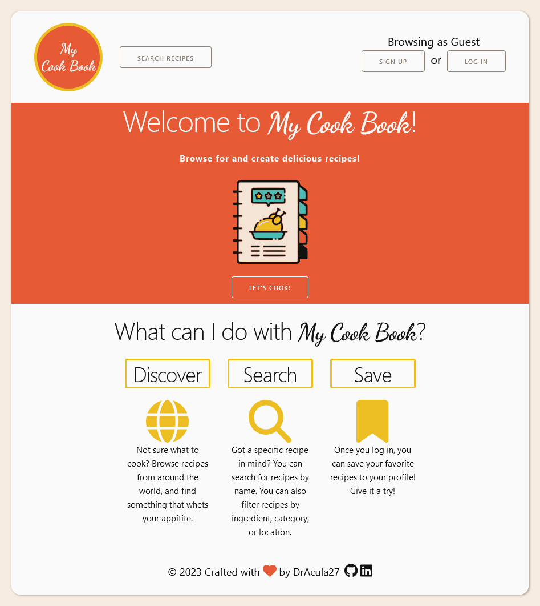

<h1 align="center">Welcome to My Cook Book!</h1>

> Per Scholas - Week 14 - Full Stack (MERN) - MODULE 3 PROJECT: Cook Book

> This is the third and final major project through my Software Engineering course at Per Scholas. It is a fully functional web application that allows users to search for, favorite, and create their own recipes.

## Features

- Anyone not logged in can:
  - Search for recipes using multiple criteria including:
    - Area, i.e. what country the recipe is from (e.g. American)
    - Category, i.e. what type of dish it is (e.g. Breakfast or Vegitarian)
    - Ingredient, i.e. an ingredient in the recipe
  - Add recipe ingredients to a shopping cart and email a shopping list.
  - Create an account or log in.
- Logged in users can perform all of the above plus:
  - Save recipes for future reference.
  - Create their own recipes.
  - Perform CRUD (Create, Read, Update, Delete) operations on recipes they created.

<!-- ## Demo -->

<!-- ### Live Link

[https://cook-book-g2cf.onrender.com/](https://cook-book-g2cf.onrender.com/) -->

<!-- ### Video

 -->

## Screenshots

**Home Page**

<kbd>
  
</kbd>

## Installation

To run the app locally:

1. Clone the repository.
1. Navigate to the root directory.
1. Install dependencies using `npm install`.
1. Create an account with [MongoDB Atlas](https://www.mongodb.com/cloud/atlas/register).
1. Create a collection called "CookBookData.
1. Create a `.env` file in the root directory and set the following environment variables:
   - `MONGOUSERNAME`
   - `MONGOPASSWORD`
   - `SESSION_SECRET`

## Technologies Used

This project uses the MERN stack.

-  [MongoDB](https://www.mongodb.com/)
-  [Express](https://expressjs.com/)
-  [React](https://reactjs.org/)
-  [Node](https://nodejs.org/en/)

Other technologies used include:
| Auth | Styling | Searching |
| -------- | ---------- | --------------------- |
| Passport | Skeleton.css | Calling TheMealDB API |
| Express-session | Custom CSS | |

## Author

👤 **Danielle Andrews**

- Github: [@DrAcula27](https://github.com/DrAcula27)
- LinkedIn: [@daniellerandrews](https://linkedin.com/in/daniellerandrews)

**This project was bootstrapped with [Create React App](https://github.com/facebook/create-react-app).**

## Available Scripts

In the project directory, you can run:

### `npm start`

Runs the app in the development mode.\
Open [http://localhost:3000](http://localhost:3000) to view it in your browser.

The page will reload when you make changes.\
You may also see any lint errors in the console.

### `npm test`

Launches the test runner in the interactive watch mode.\
See the section about [running tests](https://facebook.github.io/create-react-app/docs/running-tests) for more information.

### `npm run build`

Builds the app for production to the `build` folder.\
It correctly bundles React in production mode and optimizes the build for the best performance.

The build is minified and the filenames include the hashes.\
Your app is ready to be deployed!

See the section about [deployment](https://facebook.github.io/create-react-app/docs/deployment) for more information.

### `npm run eject`

**Note: this is a one-way operation. Once you `eject`, you can't go back!**

If you aren't satisfied with the build tool and configuration choices, you can `eject` at any time. This command will remove the single build dependency from your project.

Instead, it will copy all the configuration files and the transitive dependencies (webpack, Babel, ESLint, etc) right into your project so you have full control over them. All of the commands except `eject` will still work, but they will point to the copied scripts so you can tweak them. At this point you're on your own.

You don't have to ever use `eject`. The curated feature set is suitable for small and middle deployments, and you shouldn't feel obligated to use this feature. However we understand that this tool wouldn't be useful if you couldn't customize it when you are ready for it.

## Learn More

You can learn more in the [Create React App documentation](https://facebook.github.io/create-react-app/docs/getting-started).

To learn React, check out the [React documentation](https://reactjs.org/).

### Code Splitting

This section has moved here: [https://facebook.github.io/create-react-app/docs/code-splitting](https://facebook.github.io/create-react-app/docs/code-splitting)

### Analyzing the Bundle Size

This section has moved here: [https://facebook.github.io/create-react-app/docs/analyzing-the-bundle-size](https://facebook.github.io/create-react-app/docs/analyzing-the-bundle-size)

### Making a Progressive Web App

This section has moved here: [https://facebook.github.io/create-react-app/docs/making-a-progressive-web-app](https://facebook.github.io/create-react-app/docs/making-a-progressive-web-app)

### Advanced Configuration

This section has moved here: [https://facebook.github.io/create-react-app/docs/advanced-configuration](https://facebook.github.io/create-react-app/docs/advanced-configuration)

### Deployment

This section has moved here: [https://facebook.github.io/create-react-app/docs/deployment](https://facebook.github.io/create-react-app/docs/deployment)

### `npm run build` fails to minify

This section has moved here: [https://facebook.github.io/create-react-app/docs/troubleshooting#npm-run-build-fails-to-minify](https://facebook.github.io/create-react-app/docs/troubleshooting#npm-run-build-fails-to-minify)

## Future Work

- Incorporate an e-commerce aspect to the application where users can purchase the ingredients added to their cart.
- Add ability to allow users to delete their account.

## Attributions

- Inspiration for this project was twofold:
  1. Dealing with all the annoyances of current recipe blogs that need to tell the life story of the author before getting to the recipe.
  1. Not being able to have a central location for all the recipes I like, plus the ones handed down from my family.
- Cookbook icon is created by Flat Icons - [flaticon](https://www.flaticon.com/free-icons/recipe).
- All other icons are from [FontAwesome](https://fontawesome.com/).
- CSS boilerplate is from [Skeleton](http://getskeleton.com/).

## Show Your Support

Give a ⭐️ if you liked this project!
